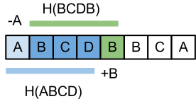

# Rabin-Karp pattern search
[Rabin-Karp](https://en.wikipedia.org/wiki/Rabin%E2%80%93Karp_algorithm) is a string searching algortihm that uses
hashing to compare the strings. The use case to find a pattern in a string.

A good hash function is important and thus picking good primes and bases is essential 
to reduce the probability of hash collisions. Since this particular implementation doesn't manually 
check for string equality between the pattern and the given word when the hash are equal, then it might
return false positive upon hash collisions.

Rabin-karp builds on the idea of rolling hash, where we have a window that contains the hash value computed from the characters within the window,
where the number of characters are the same as the length of the pattern. For each iteration we slide the window one step forward by adding the upcoming 
trailing character and  removing the previous leading character.

