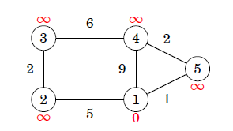

# Djikstra finding shortest path
[Djikstra](https://en.wikipedia.org/wiki/Dijkstra%27s_algorithm) algorithm resembles Bell-Ford for finding
the shortest path, except that it can't handle graphs with negative weights while Bell-ford can.
While you can use [Djikstra](https://en.wikipedia.org/wiki/Dijkstra%27s_algorithm) for a range number of 
other applications other than finding the shortest path, I just chose the latter. For an interesting
speedup to O(|E|+|V| * log |V|) for connected spares graphs, I used priority queues to find the minimum distance node that has not yet been visited.

In the case of storing the vertices in a linkedlist or array and searching for the unvisited minimum distance 
node the time complexity is O(|V|^2).

Start:
 

 
End:
 

