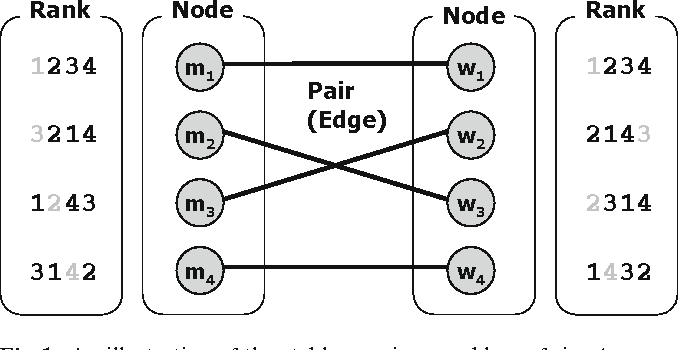

# Gale-Shapley algorithm for stable matching problem
The [Gale-Shapley algorithm](https://en.wikipedia.org/wiki/Stable_marriage_problem) finds perfect and stable matches among 2 sets, e.g men and women, based on their preferences. Every man has to be paired
with one woman, and there can't be anyone left without a partner. At the end of the algorithm each partner must have been paired in such
a way that they will not leave one another for a better partner.

