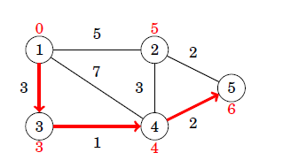

# Bellman-Ford shortest path
[Bellman-Ford](https://en.wikipedia.org/wiki/Bellman%E2%80%93Ford_algorithm) is a simple algorithm for finding
the shortest path in a weighted graph with no negative cycles. Time complexity and more details can be found in the link. Bellman-Ford is not faster than Djikstra, but unlike 
Djikstra it can handle graphs with negative weights.

