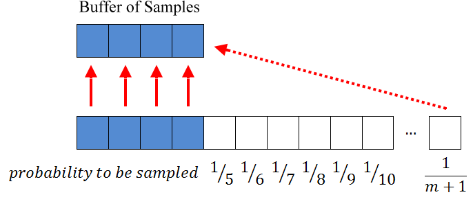

# Reservoir sampling
[Reservoir sampling](https://en.wikipedia.org/wiki/Reservoir_sampling) randomly chooses a sample of k size from 
a stream of data containing n items with uniform probability. It's useful for cases when n is so big that the data can't fit into memory.

