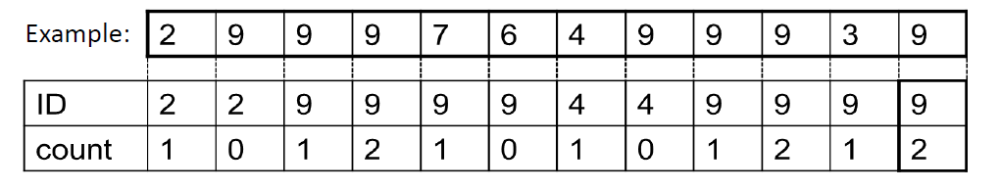

# Boyer-Moore majority vote
[Boyer-Moore majority vote](https://en.wikipedia.org/wiki/Boyer%E2%80%93Moore_majority_vote_algorithm)
is a streaming algorithm that finds the most frequent element in a stream of data
and is mostly useful for when the stream of data is too big to store in memory or when the size of the data is
unknown. The algorithm is very simple to implement and requires a second pass to verify if the stored ID 
is truly the majority.

