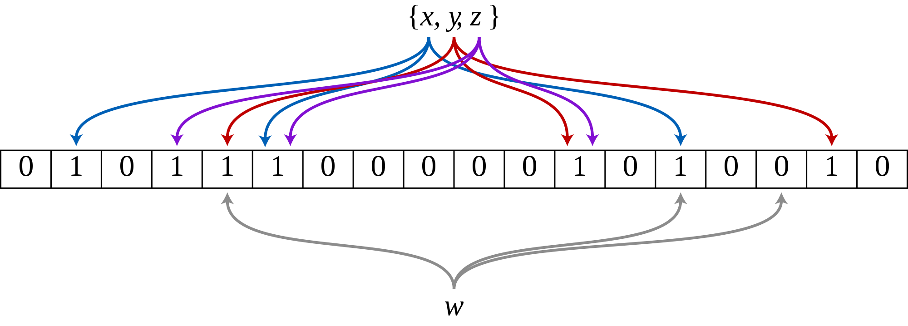

# Bloom filter
[Bloom filter](https://en.wikipedia.org/wiki/Bloom_filter) is a probabilistic data structure that hashes elements and stores them 
in a bit array. The bits are set to 1 at the indices of the hash values. So in this way bloom filters are used as a fast checkup
for element memberships. It can only say whether an element does not exist but not for certain if it exists, since false positives can that
occur due to hash collisions. The number of hash functions needed to hash the element to produce the different indices for the positions in the bit array can be calculated 
with **k = (m/n) * ln2**, where m is the number of bits needed for the bloom filter and n the number of elements needed in the bloom filter. Furthermore, to calculate the number of bits m needed 
for the bloom filter **m = (n * ln p) / (ln 2 ^ 2)**, where p is the acceptable false positive rate.

The most 2 essential operations in a bloom filter is to add elements and to check whether an element exist, however you can't remove elements in a bloom filter since it can 
lead to false negatives. When adding a new element, k hash functions hashes the element and uses these hashes as the indices to set the bits in the bit array to 1. When checking for an element, the
 k hash functions once again hashes the element and checks if all the positions at the indices are 1, if not then the element does not exist, if they are all one, then the element might exist.
 
 I used the [murmurhash3](https://en.wikipedia.org/wiki/MurmurHash) as the hash function which is suited for hash based lookups. There's an open source version of the hash implemented in c++, and 
 the python wrapper for it can be found [here](https://pypi.org/project/mmh3/).

