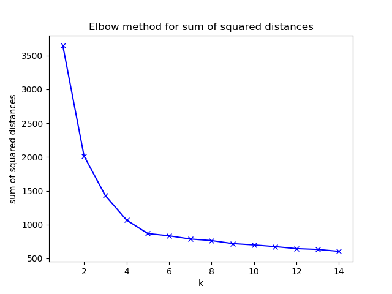

# K-means clustering
[K-means clustering](https://en.wikipedia.org/wiki/K-means_clustering) is an unsupervised machine learning algorithm, that aims to cluster data points that are near each other 
according to a centroid, i.e the data points that have the least euclidean distances to a centroid will be divided into the same cluster. 
It iteratively improves the centroid to a local optimum (not necessarily a global) by calculating the means of the data points in the cluster. 
The means are calculated by taking the euclidean distances between each point in the cluster and the origo, adding them all together and dividing them with the number of data points
in the cluster. The number of centroids is determined by k, which is the hyperparameter.

The data used was a randomly generated sample of 700 data points in 5 different clusters with standard deviation of 0.9.

I use the [elbow method](https://en.wikipedia.org/wiki/Elbow_method_(clustering) afterwards to interpret the optimal choice of k based on the sum of squared distances of each cluster for each k.
The plot that is displayed can be seen as an arm and the elbow in the plot is where the optimal k can be found. In this case the optimal k is either 4 or 5.

